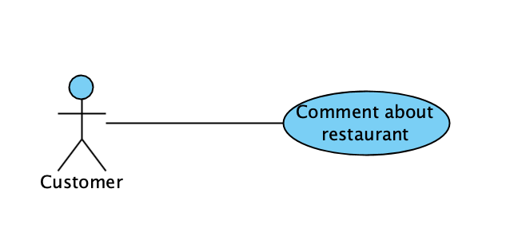

 
    <h2>Universidad Autonoma de Ciudad Juarez</h2>
    <h2>División Multidisciplinaria de Ciudad Universitaria</h2>
    <h2>Departamento de Ingeniería Electricidad y Computación</h2>
    
    <h3>Software Requirements Specification</h3>
    <h3>Daisy Ramírez Santillán 169822</h3>
    <h3>Software Engineer</h3>
    <h3>May 2019</h3>

----

## SRS: System for the control of orders in a restaurant

## Table of contents

<ul>
         <li><a href="#c1">Introduction</a></li>
         <ul>
            <li><a href="#c1_0">Business Managment Process</a></li>
            <li><a href="#c1_1">Purpose</a></li>
            <li><a href="#c1_2">Scope</a></li>
            <li><a href="#c1_3">Definitions, acronyms, and abbreviations...</a></li>
         </ul>
         <li><a href="#c2">Overall Description</a></li>
         <ul>
            <li><a href="#c2_1">Product perspective</a></li>
            <li><a href="#c2_2">Product functions</a></li>
            <li><a href="#c2_3">User characteristics</a></li>
            <li><a href="#c2_4">Constraints</a></li>
            <li><a href="#c2_5">Assumptions and dependencies</a></li>
         </ul>
         <li><a href="#c3">Requirements</a></li>
         <ul>
            <li><a href="#c3_1">Non-functional requirements</a></li>
            <li><a href="#c3_2">User requirements</a></li>
            <li><a href="#c3_3">Functional requirements</a></li>
         </ul>
         <li><a href="#ca">Appendix A Elicitation Process</a></li>
      </ul>

<h2 id='c1'> Introduction </h2>

<h3 id ='c1_0'> Business Managment Process </h3>
To extract the business model process, it was necessary to talk about the process with Fernanda Garcia, who is a waitress at a "BinFish" restaurant. The exact process is described in appendix A, the complete process and the actors involved are displayed in the diagram below. </h3>

The sub-process of cooking was generalized because of the variety of dishes that are prepared

<h3 id='c1_1'> 1.1 Purpose </h3>

The purpose of this document is to provide a detailed description of the requirements for the software that gives control of food orders and establishes synchronization amoung all employees in a restaurant. This document is intended to show the specifications of the system and development.

This system seeks to minimize the confusion between the orders and the direct interaction between the waiters with the client, and the waiters with the cooks.

This document is made for academic purposes.

<h3 id='c1_2'> 1.2 Scope </h3>

__"Ready to order"__

This system is an application for mobile devices that helps customers to place orders, pay the bill, get restaurant information. For restaurant employees provide a control of all orders and tables in the restaurant, the waiters have control of all the tables in the restaurant and the chefs get every each dish specification.

The application is available freely for Android and IOs devices from app stores of each operative system.

<h3 id='c1_3'> 1.3 Definitions, acronyms, and abbreviations...</h3>

|   Terms   |   Definition   |
|-----------|----------------|
|Order      | List of dishes and drinks for each table |
|Table      | Individual tables for 1 to 4 persons |
|Menu       | All the dishes that the restaurant has and visible to the client |
| QR code   | Code with unique identification of each table in the system | 

<h2 id='c2'>Overall Description</h2>

<h3 id='c2_1'>2.1 Product perspective </h3>

This system aims to minimize the interaction between actors by controlling orders by the application for mobile devices. It is expected that this system will be used by restaurant customers, and employees as cooks and waiters at the moment.

<h3 id='c2_2'> 2.2 Product functions</h3>

For the clients it's necessary that in their application they capture the QR code found in the table assigned by the waiter to start ordering mainly. The application registers the clients and shows them the menu of the restaurant ordered by categories. When selecting each dish, it can be included in a section of notes to give specifications of the dish or drink, and they will be added in the form of a list to confirm the order later.

Optionally, customers can see information and comments about the restaurant, request the presence of staff and pay through the application.

The waiters have control of the tables assigned to the clients, having visualization of the available tables and the requests of each one of them. They also visualize each dish ready to go and the table that corresponds to it.

The cooks receive each list generated at the moment, when finishing the dish they mark the list as finished so that the waiter continues to pick up the dishes.

<h3 id='c2_3'> 2.3 User characteristics </h3>

There are three types of users that interact with the system: restaurant costumers, cooks and waiters. Each of these three types of users has different use of the system they have their own requirements.

| User                | Characteristics |
|-----------|----------------|
| Restaurant costumer | The restaurant costumer is any person that has entered the restaurant and has been assigned a table. This person only requests a food service inside the restaurant as the main objective, optionally can get information about the restaurant and its dishes |
| Waiter | Employee in charge of the controls of tables and bring the dishes on the tables. This person through the application is only responsible for the management of the tables and bring dishes ready from the kitchen to the tables |
| Chef | Employee in charge of the prepare of the dishes. This person is in charge of preparing the dishes. Through the application you can see the list of pending dishes and confirm them as ready for waiters |
| Receptionist | Employee who is charge to receive the costumers, register the tables and provide a table or oriented |

<h3 id='c2_4'> 2.4 Constraints </h3>

Before the client requests a table in the restaurant he needs to have the application already installed on his phone, it is a restriction for the application, because it does not ensure that all the clients enter know this form of service, which is important for the restaurant can have a unique control of the service.

<h3 id='c2_5'> 2.5 Assumptions and dependencies </h3>

In this document you are assuming that the restaurant will follow the following points:

* To ensure an efficient management of the system, an assumption is that the restaurant must be willing to fully use this 
* System with its customers, allow full control of orders by this means
The restaurant must provide an open WIFI network for the restaurant costumers.

The dependencies that the system require are:

* A conection to internet
* A movil device with Android or IOs
* A conection to a data base

<h2 id='c3'> Requirements </h2>

<h3 id='c3_1'> 3.1 Non-functional requirements </h3>

1. The application must register customers to the service using QR codes located on the tables.
2. To finalize the client's stay in the application and restaurant, he must pay the bill
3. The registration of tables and saucers must be recorded in a database.
4. The application must notify in real time the requests to waiters and cooks.

<h3 id='c3_2'> 3.2 User requirements </h3>

* The application should display the menu available to clients.
* The application must be easy to use and understand for the client.
* Updates of dishes available at the moment.
* You must include payment methods in the application.
* You must include the comments and evaluation section of the restaurant and its dishes.

<h3 id='c3_3'> 3.3 Functional requirements </h3>

| No. | Description |
|-----|-------------|
| FR1 | The receptionist can assign tables for customers |
| FR2 | Restaurant customers can make a list of their dishes to order |
| FR3 | Restaurant customers can scan the QR code to identify their table |
| FR4 | The chefs can see each of the requested orders |
| FR5 | The chefs can register the order as ready |
| FR6 | The waiters can know when an order is ready to take to the table |
| FR7 | Restaurant customers can comment on the restaurant and its service |
| FR8 | Restaurant customers can request the presence of restaurant staff |

 

 
    

| User | Description |
| ---- | ----------- |
| Name | The customer request an available table. |
| Date | 16/05/2019. |
| Author | Daisy Ramírez. |
| Description | Verify that the restaurant has enough tables for the client.  |
| Actors | Customer and Receptionist |
| Pre-conditions | Is needed have to available tables. |
| Flow | The receptionist only need name and number of companions. |
| Post-conditions | The table is register with the new customer. |
 

 
    

| User | Description |
| ---- | ----------- |
| Name | The customer scan the code in the table. |
| Date | 16/05/2019. |
| Author | Daisy Ramírez. |
| Description | The QR code registers that table is active. |
| Actors | Customer and Receptionist |
| Pre-conditions | Is needed have to available tables. |
| Flow | The receptionist only need that customer scan the QR code. |
| Post-conditions | The customers are ready to order. |
 

 
    

| User | Description |
| ---- | ----------- |
| Name | The customer order |
| Date | 16/05/2019. |
| Author | Daisy Ramírez. |
| Description | The customer can order their favorite dishes and drinks. |
| Actors | Customer. |
| Pre-conditions | See the menu. |
| Flow | The customer must confirm the order. |
| Post-conditions | A list of dishes and drinks is generated |
 

 
    

| User | Description |
| ---- | ----------- |
| Name | The customer order |
| Date | 16/05/2019. |
| Author | Daisy Ramírez. |
| Description | The customer can evaluate in the section of comments. |
| Actors | Customer. |
| Pre-conditions | Open section comments in application. |
| Flow | The customer write and evaluate the restaurant in the app. |
| Post-conditions | A evaluation is added at the section comments. |
 

 
    

| User | Description |
| ---- | ----------- |
| Name | The customer pay the bill |
| Date | 16/05/2019. |
| Author | Daisy Ramírez. |
| Description | The customer can pay the bill in cash or card. |
| Actors | Customer and Waiter. |
| Pre-conditions | Select the kind of pay. |
| Flow | the customer pays with a card through the application. |
| Alternative flow | The customer call a waiter through the application and pay in cash. |
| Post-conditions | The bill is paid. |
 

 
    

| User | Description |
| ---- | ----------- |
| Name | The customer request the presence of a employee. |
| Date | 16/05/2019. |
| Author | Daisy Ramírez. |
| Description | The customer can request a presence of waiter for some reason. |
| Actors | Customer and Waiter. |
| Pre-conditions | Reason and confirm action in the application. |
| Flow | the customer select option in the application and the waiter is notified. |
| Post-conditions | The waiter arrive. |
 

 
    

| User | Description |
| ---- | ----------- |
| Name | Register the order as ready. |
| Date | 16/05/2019. |
| Author | Daisy Ramírez. |
| Description | The chef notify that order is ready to bring. |
| Actors | Chef and Waiter. |
| Pre-conditions | Have the dish ready. |
| Flow | The chef ends the dish and notified the waiter that the order is ready.|
| Post-conditions | The waiter bring the dishes. |
 

 
    

| User | Description |
| ---- | ----------- |
| Name | Give a time for wait for dishes. |
| Date | 16/05/2019. |
| Author | Daisy Ramírez. |
| Description | The chef can give a time for wait dishes in the application. |
| Actors | Chef |
| Pre-conditions | Have the order. |
| Flow | The chef calculate the estimated time for ends the order. |
| Post-conditions | Finish the order's dishes. |
 

 
    

| User | Description |
| ---- | ----------- |
| Name | Check current orders. |
| Date | 16/05/2019. |
| Author | Daisy Ramírez. |
| Description | The chef can see all current orders in the appliation. |
| Actors | Chef |
| Pre-conditions | Have orders. |
| Flow | The chef see the list of orders in the application and make each order in sequence. |
| Post-conditions | Finish the order's dishes. |

<h2 id='ca'> Appendix A Elicitation Process </h2>

The client can arrive at the restaurant and request a table for a certain number of people, should approach the receptionist. The reception has to do with the number of tables available to the client, if there is availability to register the table, a code is given, and the client is indicated where it is, if there are tables available, the reception must give times of wait for the customer It is the client's decision if he decides to wait for the table or retire. If you decide to wait, the reception will have to put you on the waiting list

At the moment that the client and his companions are reduced, the waiter redistributes the amount of menus and that is counted, the client and his companions when the dishes and drinks are ordered to the waiter, the waiter must write down each one and the list of the cooks, while the cooks prepare the food, the waiter must serve the drinks and take them immediately to the tables,

The waiters should serve the drinks and then they should be checking simultaneously if there are saucers in the window to carry the dishes to the tables,

The process is repeated for each time the customer requests dishes or drinks. Once the client decides to end the account in a waiter. The payment can be in cash or card.

The waiter must bring the account and in the case of the sea on the card, you must also bring the terminal. As soon as the payment is made and the customer will leave the waiter should clean the table and release for a new record.
